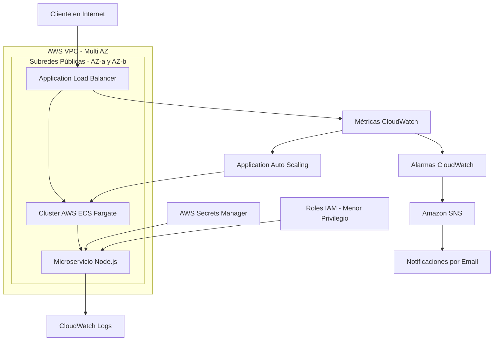

<p align="center">
  
</p>

<h1 align="center">Plataforma de Infraestructura AWS DevSecOps</h1>

<p align="center">
  <strong>Infraestructura en AWS orientada a producción, diseñada para máxima seguridad, automatización y observabilidad.</strong>
</p>

<p align="center">


</p>

<p align="center">
  <a href="https://github.com/Emanuelgm1998/aws-devsecops-infrastructure">
    
  </a>
</p>

<p align="center">
  <a href="README.md"><strong>English 🇺🇸</strong></a> &nbsp;•&nbsp; <a href="README.es.md"><strong>Español 🇪🇸</strong></a>
</p>

---

## Ingeniero

**Emanuel G. Michea** — Cloud & DevOps Engineer

[](https://www.linkedin.com/in/emanuel-gonzalez-michea/)
[](https://github.com/Emanuelgm1998)

---

## Visión General

Este repositorio implementa una **plataforma de infraestructura en AWS multi-AZ orientada a producción** construida con:

* Infraestructura como Código (**Terraform**)
* Automatización DevSecOps (**GitHub Actions**)
* Modelo de seguridad **Zero Trust**
* Microservicios contenedorizados (**ECS Fargate**)
* Observabilidad completa (**Amazon CloudWatch**)

Está diseñada como un **proyecto de portfolio de arquitectura cloud del mundo real**, alineado con roles modernos de ingeniería DevSecOps y Cloud Platform.

---

## Aspectos Destacados de la Plataforma

| Pilar de Ingeniería | Implementación Orientada a Producción |
|---|---|
| **Acceso Seguro** | Federación OIDC en GitHub Actions, roles IAM de menor privilegio, Secrets Manager y contenedores sin usuario root |
| **Entrega Automatizada** | Validación en Push y Pull Request, despliegue manual mediante Terraform, escaneo de seguridad con Checkov y Trivy |
| **Runtime Resiliente** | Balanceo de carga Multi-AZ (ALB), ECS Fargate, health checks activos y autoescalado por seguimiento de CPU |
| **Visibilidad Operacional** | Dashboards centralizados de CloudWatch, alarmas en tiempo real y notificaciones por email vía SNS |
| **Infraestructura Controlada** | Terraform modular con estado remoto versionado en S3 y bloqueo distribuido con DynamoDB |

---

## Decisiones de Arquitectura

Esta plataforma fue concebida siguiendo principios de ingeniería de producción:

- **Infraestructura como Código (IaC)** como única fuente de verdad.
- **Despliegues inmutables** gestionados con Terraform.
- **Separación de responsabilidades** entre infraestructura y aplicación.
- **Arquitectura Security-First** fundamentada en conceptos Zero Trust.
- **Observabilidad integrada** desde la fase inicial de diseño.
- **Diseño modular** preparado para futura expansión multi-ambiente (dev, staging, prod).

El proyecto prioriza conscientemente la seguridad, la automatización y la mantenibilidad por sobre despliegues apresurados.

---

## Arquitectura de Alto Nivel



> **Nota:** La implementación actual utiliza subredes públicas con segmentación estricta por Security Groups (tráfico a ECS permitido exclusivamente desde el ALB). La migración hacia subredes privadas con NAT Gateway se encuentra documentada en el roadmap.

---

## Security & Reliability Enhancements (Mejoras de Seguridad y Confiabilidad)

Esta plataforma implementa defensa en profundidad, federación de identidades de menor privilegio y resiliencia automatizada en todas las capas del entorno cloud:

### 1. Acceso Zero-Trust y Federación de Identidades
* **Federación OIDC en GitHub Actions**: Eliminación total de claves de acceso estáticas de larga duración (`AWS_ACCESS_KEY_ID` / `AWS_SECRET_ACCESS_KEY`). Los despliegues se autentican mediante tokens OpenID Connect efímeros y verificados criptográficamente, emitidos directamente por GitHub hacia AWS STS.
* **Menor Privilegio y Segregación de Roles IAM**: Separación estricta entre el **Task Execution Role** (descarga de imágenes de ECR, publicación de logs) y el **Task Role** (permisos de aplicación en runtime). Las políticas de escritura en CloudWatch Logs están acotadas exclusivamente al grupo de logs del proyecto (`/ecs/secure-saas`).

### 2. Defensa Perimetral y Segmentación de Red
* **Hardening en Application Load Balancer**: Configuración de `drop_invalid_header_fields = true` en el ALB para mitigar ataques de HTTP Desync, Request Smuggling y manipulación maliciosa de cabeceras.
* **Micro-Segmentación de Security Groups**: Las tareas ECS tienen prohibido cualquier ingreso directo desde Internet. El puerto 3000 solo acepta conexiones provenientes del ID del Security Group del ALB (`aws_security_group.alb.id`).

### 3. Hardening de Contenedores y DevSecOps Shift-Left
* **Ejecución sin privilegios (Non-Root)**: El contenedor se ejecuta bajo un usuario POSIX dedicado y sin privilegios (`USER appuser`), impidiendo que un escape de contenedor obtenga permisos de root en el host.
* **Validaciones de Seguridad Automatizadas en CI/CD**:
  * **Escaneo IaC con Checkov**: Análisis estático automatizado que verifica el cumplimiento de estándares de seguridad en Terraform antes de fusionar código a `main`.
  * **Escaneo de Contenedores con Trivy**: Auditoría de vulnerabilidades en imágenes que bloquea el pipeline ante CVEs de severidad Crítica o Alta.
  * **Pruebas Unitarias Automatizadas**: Suite nativa de Node.js (`npm test`) ejecutada en el pipeline para validar la salud de los endpoints (`/`, `/health`, manejador 404) previo al build del contenedor.

### 4. Alta Disponibilidad y Resiliencia
* **Tolerancia a Fallos Multi-AZ**: Balanceo activo de carga en múltiples Zonas de Disponibilidad (`us-east-1a`, `us-east-1b`), asegurando disponibilidad continua incluso ante caídas de centros de datos individuales.
* **Autoescalado por Seguimiento de CPU**: Escalado horizontal automático de tareas en ECS Fargate según el uso promedio de CPU (> 80%), absorbiendo picos repentinos de tráfico.
* **Health Checks Activos**: El target group del ALB sondea activamente el endpoint `/health` cada 30 segundos, reemplazando y drenando automáticamente tareas no saludables.

### 5. Observabilidad Proactiva y Respuesta a Incidentes
* **Alarmas en Tiempo Real de CloudWatch**: Monitoreo continuo de métricas clave:
  * Utilización de CPU > 80%
  * Tasa de errores HTTP 5XX > 5 errores/minuto
  * Latencia de respuesta > 2 segundos
* **Enrutamiento de Alertas con Amazon SNS**: Envío inmediato de correos electrónicos ante transiciones de estado de alarma y confirmaciones de restablecimiento (`OK actions`).
* **Dashboard Operativo Centralizado**: Visualización en un único panel del uso de CPU, latencias de peticiones y códigos de estado HTTP.

### 6. Integridad del Estado de Infraestructura
* **Estado Remoto en S3 con Cifrado y Versionado**: Cifrado `AES256` en reposo, bloqueo de acceso público y versionado de objetos para evitar pérdida accidental o manipulación del archivo de estado.
* **Bloqueo Distribuido con DynamoDB**: Adquisición automática de cerradura (`LockID`) durante `terraform plan` y `terraform apply` para evitar condiciones de carrera y ejecuciones concurrentes.

---

## Controles de Seguridad

### Implementados

| Control | Estado |
|---|---|
| IAM con Principio de Menor Privilegio | ✅ Implementado |
| Integración con Secrets Manager | ✅ Implementado |
| Contenedor con Usuario No-Root | ✅ Implementado |
| Segmentación por Security Groups | ✅ Implementado |
| Infraestructura como Código (IaC) | ✅ Implementado |
| Registro de Auditoría y Logs | ✅ Implementado |
| Monitoreo Continuo con CloudWatch | ✅ Implementado |
| Federación de Identidades OIDC | ✅ Implementado |
| Escaneos Trivy + Checkov en CI/CD | ✅ Implementado |
| Estado Remoto de Terraform con Candado | ✅ Implementado |

### En Planificación

| Control | Estado |
|---|---|
| AWS WAF v2 | 🔲 Roadmap |
| AWS Security Hub | 🔲 Roadmap |
| Amazon GuardDuty | 🔲 Roadmap |

---

## Pipeline CI/CD (GitOps)

```mermaid
flowchart LR

PUSH[Push o Pull Request] --> VALIDATE[Escaneo de Seguridad + Terraform Validate + Tests]
VALIDATE --> REVIEW[Revisión de Código / Validación]
REVIEW --> MERGE[Merge a Main]
MERGE --> GREEN[CI Aprobado Independiente de Cuenta]
GREEN --> MANUAL[Despliegue Manual Opcional]
MANUAL --> APPLY[Terraform Apply]
APPLY --> AWS[Despliegue en AWS]

AWS --> MON[Monitoreo CloudWatch]
```



Las validaciones de calidad se ejecutan sin requerir credenciales de AWS, de modo que la desconexión de una cuenta no rompe el CI. El despliegue manual opcional se autentica mediante credenciales OIDC efímeras; nunca se almacenan claves de acceso estáticas en el repositorio.

<p align="center">
  
</p>

---

## Stack de Infraestructura

| Capa | Servicio | Propósito |
|---|---|---|
| **Cómputo** | AWS ECS Fargate | Contenedores serverless |
| **Redes** | AWS VPC + ALB | Enrutamiento seguro de tráfico |
| **Seguridad** | IAM + Secrets Manager | Modelo de identidad Zero Trust |
| **Observabilidad** | Amazon CloudWatch | Logs, métricas y alarmas |
| **IaC** | Terraform | Infraestructura declarativa |
| **CI/CD** | GitHub Actions | Despliegue y validación automatizada |

---

## Estructura del Proyecto

```text
aws-devsecops-infrastructure/

├── .github/workflows/
│   ├── terraform-plan.yml       # CI de seguridad, tests y Terraform en PRs y main
│   └── terraform-apply.yml      # Despliegue manual controlado por workflow_dispatch
│
├── app/
│   ├── index.js                 # API REST en Node.js
│   ├── Dockerfile               # Contenedor seguro (usuario no-root)
│   ├── package.json
│   └── test/
│       └── index.test.js        # Pruebas unitarias nativas
│
└── terraform/
    ├── modules/
    │   ├── vpc/                 # Módulo de red
    │   ├── iam-oidc/            # Federación OIDC con GitHub Actions
    │   └── ecs/
    │       ├── main.tf          # Cluster ECS, tarea, servicio, ALB
    │       ├── iam.tf           # Roles IAM y políticas de menor privilegio
    │       ├── secrets.tf       # AWS Secrets Manager
    │       ├── sns.tf           # Notificaciones de alarma por email
    │       └── monitoring.tf    # Alarmas y dashboard CloudWatch
    ├── bootstrap/               # Recursos de estado remoto (S3 + DynamoDB)
    └── environments/
        └── dev/                 # Punto de entrada para el ambiente dev
```

---

## Observabilidad y Monitoreo

* Dashboard centralizado en CloudWatch.
* Sistema de alertas en tiempo real vía Amazon SNS.
* Métricas operacionales de infraestructura y aplicación.

### Reglas de Alerta

| Métrica | Umbral | Acción |
|---|---|---|
| **Uso de CPU** | > 80% | Alerta / Disparo de autoescalado |
| **Errores HTTP 5xx** | > 5/min | Alerta crítica |
| **Latencia** | > 2s | Advertencia de rendimiento |

<p align="center">
  
</p>

<p align="center">
  
</p>

<p align="center">
  
</p>

---

## Habilidades Profesionales Demostradas

### Ingeniería Cloud
- Redes AWS (VPC, Subredes, IGW, Tablas de Ruteo)
- ECS Fargate (orquestación serverless de contenedores)
- Balanceo de carga de aplicaciones (ALB)
- Gestión centralizada de secretos
- Monitoreo, métricas y trazabilidad de logs

### DevOps
- Terraform (IaC modular y buenas prácticas)
- GitHub Actions (automatización de pipelines CI/CD)
- Gestión del ciclo de vida de la infraestructura
- Estrategia de ambientes efímeros

### Seguridad
- Principios de Zero Trust
- Menor privilegio en IAM
- Manejo seguro de secretos
- Buenas prácticas de seguridad en contenedores (usuario no-root)
- Escaneo continuo de vulnerabilidades e IaC

### Entrega de Software
- Flujo de trabajo GitOps
- Validación en Pull Requests
- Despliegues automatizados y control de cambios

---

## Estrategia de Optimización de Costos

* **ECS Fargate**: modelo de cómputo de pago por uso sin servidores ociosos.
* **Ambientes efímeros**: posibilidad de destruir infraestructura (`terraform destroy`) al finalizar pruebas.
* **Monitoreo optimizado**: métricas configuradas para permanecer dentro del Free Tier de AWS.
* **Recursos mínimos siempre activos**: sin instancias EC2 permanentes.

Costo estimado por ciclo de despliegue de prueba: **~$0.02 por ejecución**.

---

## Despliegue

### Inicio Rápido Local (sin requerir cuenta de AWS)

La demostración local del producto inicia con un único comando:

```bash
make start
```

Abre <http://localhost:3000> o verifica el estado desde la terminal:

```bash
make health
```

Comandos útiles de ciclo de vida:

```bash
make status
make logs
make test
make stop
```

Puedes definir `APP_PORT` si el puerto 3000 está ocupado: `APP_PORT=8080 make start`.

### Despliegue Opcional en AWS

No es obligatorio contar con AWS para evaluar o probar el proyecto. El aprovisionamiento en la nube es opcional para usuarios con cuenta propia de AWS.

### Prerrequisitos
- AWS CLI configurado (`aws configure`)
- Terraform >= 1.0 instalado
- Docker instalado

### Desplegar en AWS
```bash
cd terraform/environments/dev
terraform init
terraform apply -auto-approve
```

### Obtener la URL de la Aplicación
```bash
terraform output app_url
```

### Probar Endpoint
```bash
curl $(terraform output -raw app_url)
```

Respuesta esperada:
```json
{
  "status": "ok",
  "service": "secure-saas-platform",
  "version": "1.0.0",
  "timestamp": "2026-01-01T00:00:00.000Z"
}
```

<p align="center">
  
</p>

### Destruir Recursos
```bash
terraform destroy -auto-approve
```

---

## Evidencia de Despliegue en AWS

El repositorio cuenta con validación de despliegues reales en AWS:

- Planes de ejecución de Terraform (más de 18 recursos gestionados)
- Servicio ECS Fargate operativo y respondiendo peticiones HTTP
- Dashboard y alarmas de CloudWatch activos
- Pipeline de CI/CD ejecutado exitosamente mediante GitHub Actions

<p align="center">
  
</p>

<p align="center">
  
</p>

---

## Roadmap

- [ ] Subredes privadas + NAT Gateway
- [ ] Ambientes de staging y producción independientes
- [ ] Certificado TLS/HTTPS con AWS Certificate Manager (ACM) en el ALB
- [ ] Integración de AWS WAF v2 + Amazon GuardDuty + AWS Security Hub
- [ ] Claves KMS gestionadas por el cliente (CMK) con rotación automática
- [ ] Reemplazar la política broad del rol de despliegue por permisos específicos por servicio

---

## Historial de Cambios (Changelog)

### 2026-09-11
- Corrección de versiones en GitHub Actions (`@v4` en checkout y configure-aws-credentials).
- Fijación de versión inmutable para Trivy (`@0.28.0`) mitigando riesgos de Supply Chain.
- Incorporación de suite de pruebas unitarias automatizadas (`npm test`) con el runner nativo de Node.js.
- Hardening en ALB habilitando `drop_invalid_header_fields = true`.
- Aplicación de principio de menor privilegio en políticas IAM de CloudWatch Logs.
- Eliminación de archivos huérfanos obsoletos en el directorio raíz de Terraform.
- Creación de documentación bilingüe (Español / Inglés) y sección dedicada de mejoras de seguridad.

### 2026-07-21
- Reemplazo de secretos estáticos por contraseñas autogeneradas de 24 caracteres.
- Conexión de alarmas de CloudWatch a notificaciones por correo vía Amazon SNS.
- Configuración de autoescalado con target tracking de CPU para ECS.
- Creación de estado remoto versionado en S3 con candado en DynamoDB.
- Migración de autenticación en GitHub Actions hacia federación OIDC en AWS.
- Integración de escaneo IaC con Checkov y escaneo de vulnerabilidades con Trivy en el pipeline.

---

## Valor de Negocio

Este proyecto evidencia la capacidad de:

- Diseñar arquitecturas cloud seguras desde los cimientos.
- Automatizar despliegues continuos mediante pipelines robustos de CI/CD.
- Aplicar las mejores prácticas de seguridad en infraestructura y contenedores.
- Construir entornos cloud escalables, mantenibles y observables.
- Operar cargas de trabajo en AWS orientadas a producción real.

---

## Licencia

**Proprietary software — All Rights Reserved.**

Copyright © 2026 **Emanuel G. Michea**.

Queda prohibida la copia, modificación, redistribución, sublicenciamiento o uso comercial no autorizado del código fuente, definiciones de infraestructura, documentación y recursos visuales de este repositorio sin el consentimiento previo por escrito del titular de los derechos de autor.

Para consultas de licenciamiento comercial o consultoría:

[](https://www.linkedin.com/in/emanuel-gonzalez-michea/)

Consulta el archivo [LICENSE](LICENSE) para más detalles.
