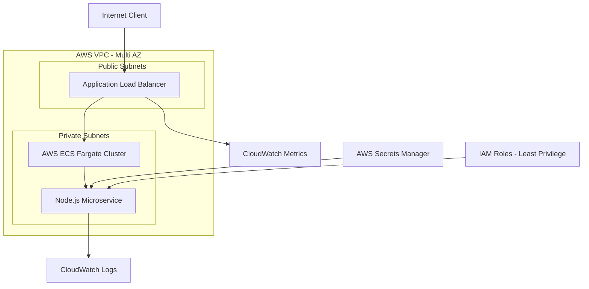
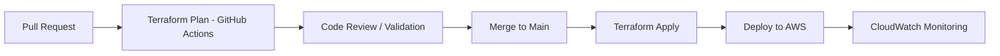

# Production-Ready AWS DevSecOps Infrastructure Platform

<p align="center">


</p>

---

## 👤 Engineer Profile

**Emanuel Ernesto González Michea**
Emanuel Ernesto González Michea

Portfolio & professional profile:
LinkedIn
[https://www.linkedin.com/in/emanuel-gonzalez-michea/](https://www.linkedin.com/in/emanuel-gonzalez-michea/)

---

## 🧭 Overview

This repository implements a **production-grade, multi-AZ AWS infrastructure platform** built with:

* Infrastructure as Code (Terraform)
* DevSecOps automation (GitHub Actions)
* Zero Trust security model
* Containerized microservices (ECS Fargate)
* Full observability (CloudWatch)

It is designed as a **real-world cloud architecture portfolio project** aligned with modern DevSecOps engineering roles.

---

## 🏗️ High-Level Architecture



---

## 🔐 Zero Trust Security Model

### Identity & Access Control

* Separate IAM roles:

  * ECS Task Execution Role (infra only)
  * ECS Task Role (application permissions only)
* Principle of Least Privilege enforced at every layer

### Network Security

* Private subnets for compute layer (no public IPs)
* Only ALB exposed to internet (HTTPS 443)
* Security Group strict inbound rules (ALB → ECS only)

### Secrets Management

* No hardcoded credentials
* Runtime injection via AWS Secrets Manager
* Secure environment variable resolution at container startup

---

## 🔄 CI/CD Pipeline (GitOps)



---

## 🧱 Infrastructure Stack

| Layer         | Service               | Purpose                    |
| ------------- | --------------------- | -------------------------- |
| Compute       | AWS ECS Fargate       | Serverless containers      |
| Networking    | AWS VPC + ALB         | Secure traffic routing     |
| Security      | IAM + Secrets Manager | Zero Trust identity model  |
| Observability | CloudWatch            | Logs, metrics, alarms      |
| IaC           | Terraform             | Declarative infrastructure |
| CI/CD         | GitHub Actions        | Automated deployment       |

---

## 📁 Project Structure

```text
aws-devsecops-infrastructure/

├── .github/workflows/
│   ├── terraform-plan.yml
│   └── terraform-apply.yml

├── app/
│   ├── index.js
│   ├── Dockerfile
│   └── package.json

└── terraform/
    ├── modules/
    │   ├── vpc/
    │   └── ecs/
    │       ├── main.tf
    │       ├── iam.tf
    │       ├── secrets.tf
    │       └── monitoring.tf
    └── environments/
        └── dev/
```

---

## 📡 Observability & Monitoring

* Centralized CloudWatch Dashboard
* Real-time alerting system
* Application + infrastructure metrics

### Alert Rules

| Metric    | Threshold | Action                |
| --------- | --------- | --------------------- |
| CPU Usage | > 80%     | Alert / Scale trigger |
| HTTP 5xx  | > 5/min   | Critical alert        |
| Latency   | > 2s      | Performance warning   |

---

## 💸 Cost Optimization Strategy

* ECS Fargate: pay-per-use compute model
* Ephemeral environments (terraform destroy)
* Free-tier optimized monitoring
* Minimal always-on resources

Estimated cost per test deployment:
👉 ~$0.02 per execution cycle

---

## 🚀 Deployment

```bash
cd terraform/environments/dev
terraform init
terraform apply -auto-approve
```

### Destroy stack

```bash
terraform destroy -auto-approve
```

---

## 🧠 Key DevSecOps Principles Demonstrated

* Zero Trust Architecture
* Immutable infrastructure
* GitOps-based deployments
* Least privilege IAM design
* Secrets isolation
* Multi-AZ resiliency
* Observability-first design

---

## 🧾 Why this project matters

This project demonstrates **production-level thinking**, not just AWS usage:

* Security-first design (not afterthought)
* Real CI/CD pipeline (like enterprise teams)
* Scalable container architecture
* Recruiter-ready documentation
* Cloud engineering maturity

