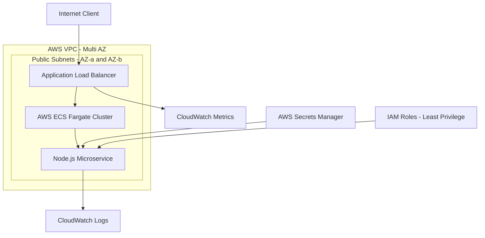
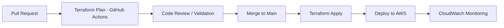

# AWS DevSecOps Infrastructure Platform
### Production-Oriented Cloud Engineering Portfolio Project

<p align="center">


</p>

<p align="center">
  <a href="https://github.com/Emanuelgm1998/aws-devsecops-infrastructure">
    
  </a>
</p>

---

## Engineer Profile

**Emanuel G. Michea** — Cloud & DevOps Engineer

[](https://www.linkedin.com/in/emanuel-gonzalez-michea/)
[](https://github.com/Emanuelgm1998)

---

## Overview

This repository implements a **production-oriented, multi-AZ AWS infrastructure platform** built with:

* Infrastructure as Code (Terraform)
* DevSecOps automation (GitHub Actions)
* Zero Trust security model
* Containerized microservices (ECS Fargate)
* Full observability (CloudWatch)

It is designed as a **real-world cloud architecture portfolio project** aligned with modern DevSecOps engineering roles.

---

## Architecture Decisions

This platform was designed following production engineering principles:

- Infrastructure as Code as the single source of truth
- Immutable deployments using Terraform
- Separation of infrastructure and application responsibilities
- Security-first architecture based on Zero Trust concepts
- Observability integrated from the beginning
- Modular design for future multi-environment expansion

The project intentionally prioritizes security, automation, and maintainability over rapid deployment.

---

## High-Level Architecture



> **Note:** Current implementation uses public subnets with Security Group restrictions (ALB → ECS only). Migration to private subnets + NAT Gateway is included in the roadmap.

---

## Security Controls

### Implemented

| Control | Status |
|---|---|
| Least Privilege IAM | ✅ Implemented |
| Secrets Manager Integration | ✅ Implemented |
| Container Non-Root User | ✅ Implemented |
| Security Group Segmentation | ✅ Implemented |
| Infrastructure as Code | ✅ Implemented |
| Audit Logging | ✅ Implemented |
| CloudWatch Monitoring | ✅ Implemented |

### Planned

| Control | Status |
|---|---|
| OIDC Federation (replace static keys) | 🔲 Roadmap |
| AWS WAF | 🔲 Roadmap |
| Security Hub | 🔲 Roadmap |
| GuardDuty | 🔲 Roadmap |
| AWS Config | 🔲 Roadmap |
| Trivy + Checkov in CI/CD | 🔲 Roadmap |

---

## CI/CD Pipeline (GitOps)



AWS credentials stored as encrypted GitHub Actions repository secrets. Never exposed in logs or code.

---

## Infrastructure Stack

| Layer | Service | Purpose |
|---|---|---|
| Compute | AWS ECS Fargate | Serverless containers |
| Networking | AWS VPC + ALB | Secure traffic routing |
| Security | IAM + Secrets Manager | Zero Trust identity model |
| Observability | CloudWatch | Logs, metrics, alarms |
| IaC | Terraform | Declarative infrastructure |
| CI/CD | GitHub Actions | Automated deployment |

---

## Project Structure

```text
aws-devsecops-infrastructure/

├── .github/workflows/
│   ├── terraform-plan.yml       # Triggered on Pull Request
│   └── terraform-apply.yml      # Triggered on merge to main

├── app/
│   ├── index.js                 # Node.js REST API
│   ├── Dockerfile               # Secure container (non-root user)
│   └── package.json

└── terraform/
    ├── modules/
    │   ├── vpc/                 # Networking module
    │   └── ecs/
    │       ├── main.tf          # ECS cluster, task, service, ALB
    │       ├── iam.tf           # IAM roles + least privilege policies
    │       ├── secrets.tf       # AWS Secrets Manager
    │       └── monitoring.tf    # CloudWatch alarms + dashboard
    └── environments/
        └── dev/                 # Dev environment entry point
```

---

## Observability & Monitoring

* Centralized CloudWatch Dashboard
* Real-time alerting system
* Application + infrastructure metrics

### Alert Rules

| Metric | Threshold | Action |
|---|---|---|
| CPU Usage | > 80% | Alert / Scale trigger |
| HTTP 5xx | > 5/min | Critical alert |
| Latency | > 2s | Performance warning |

---

## Professional Skills Demonstrated

### Cloud Engineering
- AWS Networking (VPC, Subnets, IGW, Route Tables)
- ECS Fargate (serverless container orchestration)
- Application Load Balancing
- Secrets Management
- Monitoring and Logging

### DevOps
- Terraform (modular IaC)
- GitHub Actions (CI/CD automation)
- Infrastructure Lifecycle Management
- Ephemeral environment strategy

### Security
- Zero Trust Principles
- IAM Least Privilege
- Secure Secrets Handling
- Secure Container Practices (non-root user)

### Software Delivery
- GitOps Workflow
- Pull Request Validation
- Automated Deployments
- Change Control

---

## Cost Optimization Strategy

* ECS Fargate: pay-per-use compute model
* Ephemeral environments (terraform destroy when not in use)
* Free-tier optimized monitoring
* Minimal always-on resources

Estimated cost per test deployment: **~$0.02 per execution cycle**

---

## Deployment

### Prerequisites
- AWS CLI configured (`aws configure`)
- Terraform >= 1.0 installed
- Docker installed

### Deploy
```bash
cd terraform/environments/dev
terraform init
terraform apply -auto-approve
```

### Get app URL
```bash
terraform output app_url
```

### Test
```bash
curl $(terraform output -raw app_url)
```

Expected response:
```json
{
  "status": "ok",
  "service": "secure-saas-platform",
  "version": "1.0.0",
  "timestamp": "2026-01-01T00:00:00.000Z"
}
```

### Destroy
```bash
terraform destroy -auto-approve
```

---

## Deployment Evidence

The repository includes real infrastructure deployments validated in AWS:

- Terraform execution plans (18+ resources)
- ECS Fargate service running and responding
- CloudWatch dashboard active
- CI/CD pipeline execution via GitHub Actions

Screenshots and deployment evidence will be maintained as the project evolves.

---

## Roadmap

- [ ] OIDC GitHub Actions → AWS (replace static Access Keys)
- [ ] Terraform Remote State (S3 + DynamoDB locking)
- [ ] Private subnets + NAT Gateway
- [ ] Trivy + Checkov security scanning in CI/CD pipeline
- [ ] staging and prod environments
- [ ] HTTPS with ACM certificate on ALB
- [ ] AWS WAF + GuardDuty + Security Hub

---

## Business Value

This project demonstrates the ability to:

- Design secure cloud infrastructure from scratch
- Automate deployments through CI/CD pipelines
- Apply infrastructure security best practices
- Build maintainable and scalable cloud environments
- Operate production-oriented AWS workloads

The architecture reflects engineering decisions commonly found in modern cloud-native organizations.


---

## License

This project is licensed under the MIT License.

Copyright (c) 2026 Emanuel G. Michea
